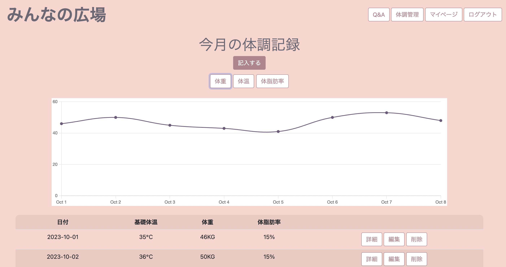

# みんなの広場

不妊治療に関わる交流サイトです。
人には相談しづらいこと、話しづらいこと、なんでも言える場所です。
簡易登録で体調管理ツールとしても利用できます。
 

- 不妊治療に関わる Q&A ページ
  

- 体調管理ページ
  

## 作成背景

近年、不妊に悩む人が増加している一方、不妊に関わる交流サイトが少ないと感じました。
友達や家族、周りの人に聞きづらいことや話しづらいことも同じ悩みを持つ人達と交流することで、少しでも不安や悩みが解決できるよう作成しました。  
またこのサイトを通して、妊活を考える前の方にも不妊治療について知るきっかけになればと思います。

## サンプルログイン

画面トップ右上の「ゲストログイン」からご利用ください。

## 使用技術

- Ruby '2.7.7'
- Ruby on Rails '~> 7.0.6'
- Javascript
- Sqlite3 '~> 1.4'
- AWS
  - AWS CLI
  - ECR
  - ECS
- Docker
- GitHub Actions
- Rubocop
- Bootstrap '~> 5.0.2'
- chartkick
- Rspec '~> 6.0.0'
- The FoodData Central API

## アプリケーション全体図

## 機能一覧

- ユーザー登録・編集機能
- ログイン機能
- Q&A 投稿機能
- 体調管理
  - 新規投稿
  - 投稿編集
  - 投稿削除
  - データのグラフ表示 (chartkick)
- 栄養成分の検索機能 (The FoodData Central API)

## LICENCE

U.S. DEPARTMENT OF AGRICULTURE
https://fdc.nal.usda.gov/api-guide.html
